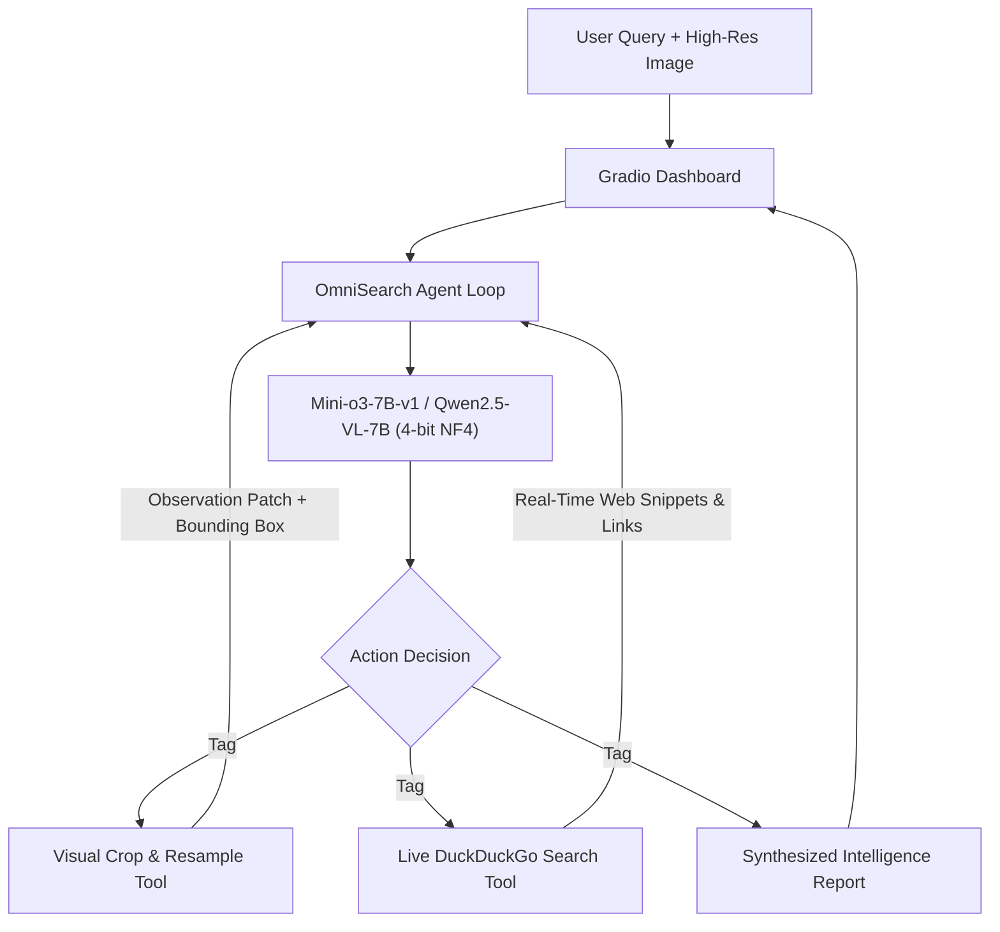

# 🦅 OmniSearch Agent
### Autonomous Multi-Turn Visual Discovery & Live Web Intelligence

[](https://www.python.org/)
[](https://pytorch.org/)
[](https://opensource.org/licenses/Apache-2.0)
[](https://www.nvidia.com/)
[](https://gradio.app/)

---

## 🌟 Overview

Standard vision-language models (VLMs) and visual search engines (like Google Lens) are single-turn black boxes: they inspect an image once and guess. When dealing with high-resolution imagery containing tiny text, hidden serial numbers, obscure logos, or fine-grained defects, they hallucinate or overlook critical evidence.

**OmniSearch Agent** bridges this gap by turning the model into an **autonomous visual investigator**:
1. **Perceives** an overall high-resolution scene.
2. **Reasons Step-by-Step** (`<think>`) about where identifying clues lie.
3. **Executes Visual Actions** (`<grounding>{"bbox_2d": ...}</grounding>`) to crop and zoom into candidate regions over multiple interaction turns.
4. **Queries the Live Internet** (`<web_search>query</web_search>`) using free real-time search (DuckDuckGo) once key markers/models are identified.
5. **Synthesizes a Comprehensive Report** connecting visual proof to real-time market data, technical specifications, or prices.

---

## 🏗️ Architecture



---

## ⚡ 16GB VRAM Optimization (RTX A4000)

Running a 7B multimodal reasoning model with multi-turn high-resolution image tokens usually risks out-of-memory (OOM) errors on 16GB cards. OmniSearch Agent solves this via:
* **4-bit NF4 Quantization** via `bitsandbytes` (`bnb_4bit_use_double_quant=True`, `compute_dtype=bfloat16`).
* **Memory Footprint**:
  * Base Model: **~4.8 GB**
  * Image Tokens & Multi-turn KV Cache: **~3.2 GB**
  * Gradio & System Buffers: **~0.6 GB**
  * **Total Peak VRAM**: **~8.6 GB / 16 GB** (Leaves >7 GB headroom!).

---

## 🚀 Quickstart

### 1. Prerequisites
- Linux with NVIDIA GPU (e.g. RTX A4000, RTX 3080/3090/4080, T4, or A10G)
- CUDA 12.x / 13.x

### 2. Setup
```bash
git clone https://github.com/tsyncIO/omnisearch-agent.git
cd omnisearch-agent

# Create virtual environment
python3 -m venv --system-site-packages .venv
source .venv/bin/activate

# Install dependencies
pip install -r requirements.txt
```

### 3. Launch the Interactive UI
```bash
./run.sh 7860
```
Open `http://localhost:7860` in your web browser.

---

## 📂 Project Structure

```
omnisearch-agent/
├── app.py                      # Interactive Gradio dashboard
├── run.sh                      # One-click execution script
├── requirements.txt            # Python dependencies
├── agent/
│   ├── __init__.py
│   ├── prompts.py              # System prompts & multi-turn templates
│   └── visual_search_agent.py  # Agent loop with streaming updates & tool dispatch
└── tools/
    ├── __init__.py
    ├── visual_tools.py         # Image cropping, Lanczos resizing, bounding box overlay
    └── web_tools.py            # Live DuckDuckGo search integration & markdown formatter
```

---

## 💡 Real-World Applications

* **Luxury Goods & Antiques Authentication**: Zooming into dial hallmarks, serial numbers, and cross-referencing auction histories.
* **Electronics & PCB Inspection**: Reading microscopic chip part numbers and pulling datasheet specs from manufacturer portals.
* **Gigapixel Document & Invoice Auditing**: Inspecting dense footnotes and verifying corporate registry data.
* **Geospatial & Satellite Reconnaissance**: Inspecting high-res drone/satellite imagery to count assets and verify coordinates.

---

## 📜 Acknowledgements

Built upon principles and foundations from:
* [Mini-o3: Scaling Up Reasoning Patterns and Interaction Turns for Visual Search (ICLR 2026)](https://arxiv.org/pdf/2509.07969)
* [veRL: Volcano Engine Reinforcement Learning for LLM](https://github.com/volcengine/verl)
* [Qwen2.5-VL](https://github.com/QwenLM/Qwen2.5-VL)
