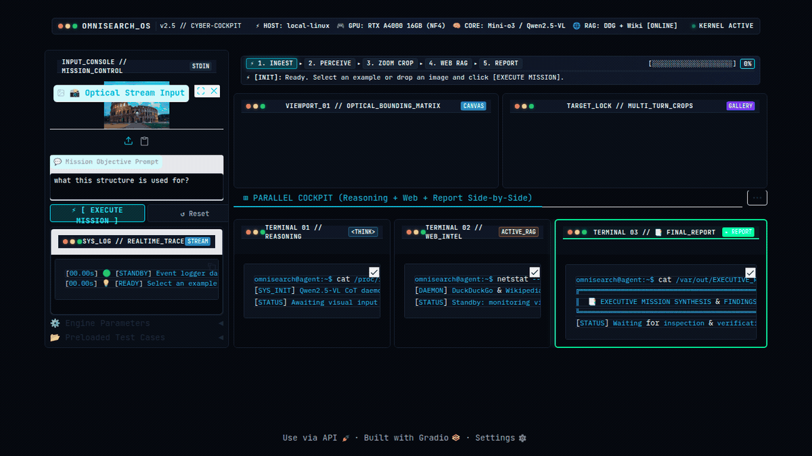
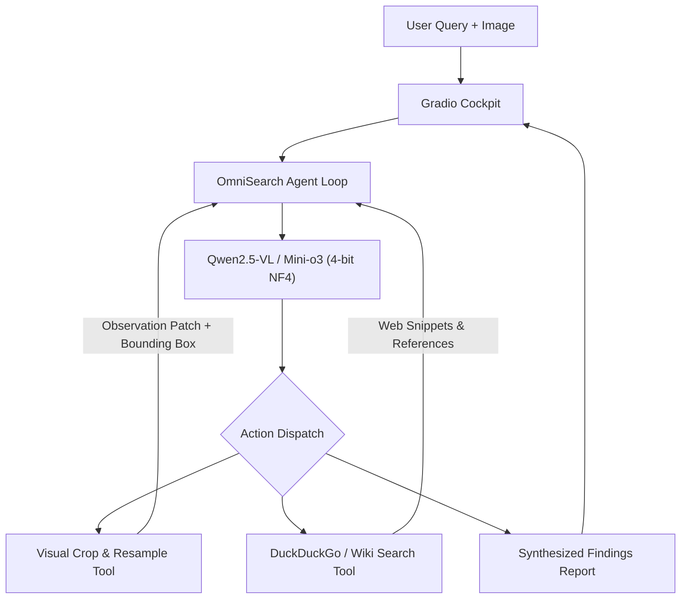

# OmniSearch Agent
### Multi-Turn Visual Discovery & Live Web Intelligence

[](https://www.python.org/)
[](https://pytorch.org/)
[](https://opensource.org/licenses/Apache-2.0)
[](https://www.nvidia.com/)
[](https://gradio.app/)

---

<p align="center">
  
</p>

<p align="center">
  <b>Cockpit UI Demo:</b> Autonomous landmark analysis of the Roman Colosseum using multi-turn visual grounding, real-time web verification, and report synthesis.
</p>

---

## Overview

Single-turn vision-language models and visual lookup tools evaluate inputs once without iterative verification. For dense imagery containing small typography, serial identifiers, fine architectural details, or defects, single-pass inspection frequently overlooks key visual evidence.

**OmniSearch Agent** addresses this with an iterative agentic architecture:
1. **Scene Ingest & Perception**: Analyzes high-resolution input imagery to identify candidates for deeper inspection.
2. **Step-by-Step Reasoning**: Maintains explicit reasoning traces (`<think>`) across turns to plan targeted actions.
3. **Visual Action Execution**: Emits normalized bounding box targets (`<grounding>{"bbox_2d": ...}</grounding>`) to crop and resample regions of interest via Lanczos interpolation.
4. **Live Web Grounding**: Emits targeted search requests (`<web_search>query</web_search>`) to retrieve factual context from DuckDuckGo and Wikipedia.
5. **Report Synthesis**: Synthesizes verified findings into a structured report (`<answer>`) backed by visual and external evidence.

---

## Architecture



---

## Memory & VRAM Optimization

Multi-turn high-resolution multimodal inference is optimized for single-GPU environments (e.g., NVIDIA RTX A4000 16GB):
* **Quantization**: 4-bit NormalFloat4 (NF4) via `bitsandbytes` (`bnb_4bit_use_double_quant=True`, `compute_dtype=bfloat16`).
* **VRAM Allocation Profile**:
  * Base Model Weights: **~4.8 GB**
  * Image Tokens & Multi-Turn Cache: **~3.2 GB**
  * Gradio & System Buffers: **~0.6 GB**
  * **Peak Allocation**: **~8.6 GB / 16 GB** (>7 GB operational headroom).

---

## Quickstart

### Prerequisites
- Linux with NVIDIA GPU (e.g. RTX A4000, RTX 3080/3090/4080, T4, A10G)
- CUDA 12.x / 13.x

### Setup
```bash
git clone https://github.com/tsyncIO/omnisearch-agent.git
cd omnisearch-agent

# Create virtual environment
python3 -m venv --system-site-packages .venv
source .venv/bin/activate

# Install dependencies
pip install -r requirements.txt
```

### Run
```bash
./run.sh 7860
```
Navigate to `http://localhost:7860` in your browser.

---

## Project Structure

```
omnisearch-agent/
├── app.py                      # Interactive Gradio cockpit dashboard
├── run.sh                      # Shell launch script
├── requirements.txt            # Python dependencies
├── agent/
│   ├── __init__.py
│   ├── prompts.py              # System prompts & multi-turn templates
│   └── visual_search_agent.py  # Agent execution loop, streaming, and tool dispatch
├── tools/
│   ├── __init__.py
│   ├── visual_tools.py         # Image cropping, Lanczos resampling, box annotation
│   └── web_tools.py            # DuckDuckGo and Wikipedia retrieval integration
└── scripts/
    └── record_demo.py          # Headless recording automation script
```

---

## Applications

* **Hardware & PCB Inspection**: Reading surface-mount markings and cross-referencing component datasheets.
* **Document & Asset Auditing**: Inspecting fine-print typography, serial tags, and external verification records.
* **Object & Landmark Identification**: Inspecting structural markers and retrieving live historical documentation.
* **Auction & Provenance Verification**: Inspecting dial hallmarks, maker signatures, and auction database records.

---

## References & Acknowledgements

* [Mini-o3: Scaling Up Reasoning Patterns and Interaction Turns for Visual Search (ICLR 2026)](https://arxiv.org/pdf/2509.07969)
* [veRL: Volcano Engine Reinforcement Learning for LLM](https://github.com/volcengine/verl)
* [Qwen2.5-VL](https://github.com/QwenLM/Qwen2.5-VL)
